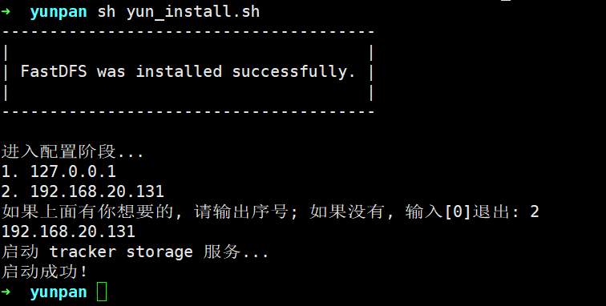

# InstallScript-of-Pan
YouGuan网盘的一键部署脚本

# 起因
YouGuan网盘作为我本科的毕设项目。其主要目的是，希望做一个非营利性的个人网盘。尽管暂时不能预料它的发展方向，以及存活周期——但事实上，这些并不重要。正如《黑客与画家》的作者所说：“程序员并不知道他将会做出什么。”

# 仓库说明
InstallScript-of-Pan为YouGuan网盘提供一键部署脚本。

- yun_install.sh 负责一键安装
- uninstall.sh 负责一键卸载

# 更新日志

**019.5.1**
1. 完成 fastcgi、spawn-fcgi 的安装与卸载（`install/fcgi.sh`, `uninstal/fcgi.sh`）
2. 增加 `echo_note`、`echo_error` 用于黄色提示、红色告警
3. 增加测试程序 `test` ，由 spawn-fcgi 守护，并对其做 nginx 相关配置。你可以键入 `http://你的域名或者ip名字/test.html`，之后会跳转到如下画面：


该页面用于检测 fastcgi 是否正常运行。如果你对 post 请求进行测试，可能会有如下回应：


同时，在你的服务器中，键入 `ps aux|grep test`，应该能看到名为 `test` 的程序正在运行。

**019.4.29**
1. 完成 nginx 的自动安装
2. 完成 nginx 的部分卸载

---

3. 完成 nginx 自动卸载，修复 nginx 自动安装时出现的一些小 bug （现在 nginx 的自动安装完全可用了）


**019.4.21**
1. 增加文件下载功能
2. 增加删除文件功能
3. 增加 main.c ，合并上传、下载、删除功能

**019.4.20**
1. 对日志记录做修改，增加 `INFO`,`DEBUG`,`ERROR` 三个日志等级选项。同时，将默认的“日志写入文件”修改为“激活模式”。当 `FILE_LOG`（log.h 文件中） 被激活后，日志写入文件；否则日志信息标准输出。

---

2. 对日志功能进一步修改，修改为 “可控” 。在 log.h 文件中：
```c
#define NEED_DEBUG 0
#define NEED_INFO 1
#define NEED_ERROR 1
```
当设置为 0 ，即什么都不做（既不计入文件，也不标准输出）。默认打开 info、error 功能。

3. 增加文件上传功能。

**019.4.17**
1. 调整目录结构，原有的第三方软件统一修改为 .tar.gz 压缩包形式存在安装包中，这样做可以避免它们被污染
2. 相关内容统一安装至 /opt/YouGuan 
3. 增加 hiredis 的安装与卸载

**019.4.15**
1. 增加 redis 的安装与卸载（db_install.sh, db_uninstall.sh）

**019.4.14**
1. 增加日志功能

**019.4.10**
1. 完善 uninstall.sh 脚本，实现 fastDFS 卸载与相关文件的删除、libfastcommon 相关文件的删除
2. 移除项目中编译后生成的 .o 文件
3. 分离 print_formant 函数，单独存在 tools.lib 中

**019.4.9**
1. 将安装 fastdfs 与 libfastcommon 从之前的**在线安装**修改为**离线安装**。即：安装包将自带所需环境（暂时不支持 gcc 的离线安装）。
2. 对 yun_install.sh 脚本中，增加默认捕获服务器 ip 功能。也可以选择 0 退出，之后脚本会要求用户手动输入 ip 。
3. 增加对 tracker.conf、storage.conf、client.conf 的自动化配置（仅支持单机模式），并且自动启动 tracker 与 storage 。
4. 可用命令 `fdfs_monitor client.conf` 检查 tracker、storage 是正常运行


**019.3.23**
1. 增加 uninstall.sh 脚本，负责卸载相应环境
2. 对 yun_install.sh 脚本中，增加 gcc 安装，增加对安装环境判断。如果所需程序已在环境中，则不再重复安装。

**019.3.18**
1. GitHub上创建仓库
2. 添加 yun_install.sh 脚本，负责安装 libfastcommon fastdfs (安装成功后，可以通过`fdfs_test`命令查看)
